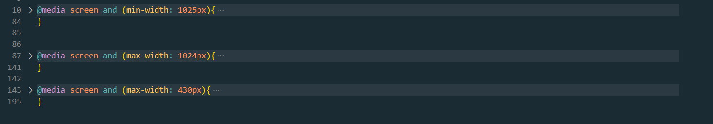

# Frontend Mentor - QR code component solution

This is a solution to the [QR code component challenge on Frontend Mentor](https://www.frontendmentor.io/challenges/qr-code-component-iux_sIO_H). Frontend Mentor challenges help you improve your coding skills by building realistic projects.

## Table of contents

- [Overview](#overview)
  - [Screenshot](#screenshot)
  - [Built with](#built-with)

## Overview

Minha proposta de resolução do desafio era apenas usar HTML e CSS, foi simples porém produtivo para mim. Sendo um simple QR code que se adapta em outras resoluões de tela. Eu achei o resultado OK, poderia melhorar com mais estudos, mas consegui concluir a tarefa.

### Screenshot

Uma das formas que encontrei para resolver o problema de adaptatibilidade para mobile foi dividir o código CSS a partir de diferentes tamanhos de screen(código do print acima). Não sei se essa é a melhor forma, porém funcionou para a minha proposta, que é usar apenas HTML e CSS.

### Built with

- Semantic HTML5 markup
- CSS custom properties
